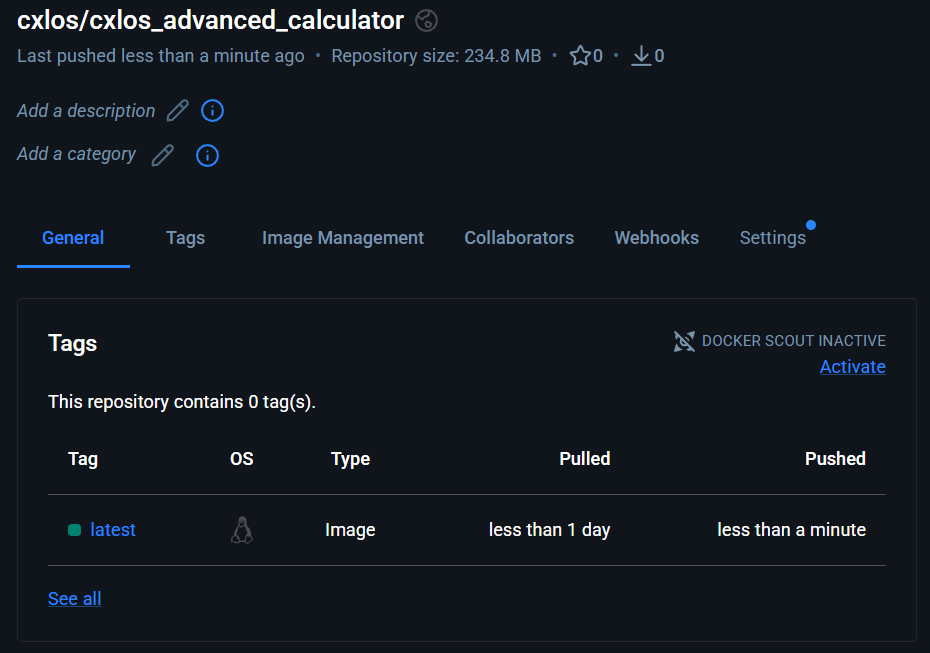
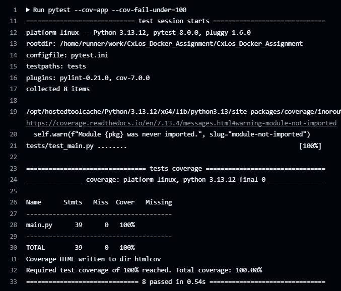

# 🧮 CxLos Advanced Calculator Project
---

## Project Description
Hello and Welcome to my docker practice repo! here is where you will see me learning about docker and how to use it.

## 📂 Table of Contents 
    
- [Preview](#️-application-preview)
- [1. Install Homebrew (Mac Only)](#-1-install-homebrew-mac-only)
- [2. Install and Configure Git](#-2-install-and-configure-git)
- [3. Clone the Repository](#-3-clone-the-repository)
- [4. Install Python 3.10+](#️-4-install-python-310)
- [5. (Optional) Docker Setup](#-5-optional-docker-setup)
- [6. Running the Project](#-6-running-the-project)
- [Quick Links](#-quick-links)
- [Images](#️-images)
- [Refelction](#️-reflection)

---

# Calculator App Preview

**🧮 [Calculator App](https://hub.docker.com/repository/docker/cxlos/601_module8/general)**


# DockerHub Repo Preview

**🌐 [View on Docker Hub](https://hub.docker.com/repository/docker/cxlos/cxlos_advanced_calculator/general)**



## Successfully Booted-up Docker Server


## User Registration/ Login


## Calculation Endpoints


## Successful Github Actions run



---

# 🧩 1. Install Homebrew (Mac Only)

> Skip this step if you're on Windows.

Homebrew is a package manager for macOS.  
You’ll use it to easily install Git, Python, Docker, etc.

**Install Homebrew:**

```bash
/bin/bash -c "$(curl -fsSL https://raw.githubusercontent.com/Homebrew/install/HEAD/install.sh)"
```

**Verify Homebrew:**

```bash
brew --version
```

If you see a version number, you're good to go.

---

# 🧩 2. Install and Configure Git

## Install Git

- **MacOS (using Homebrew)**

```bash
brew install git
```

- **Windows**

Download and install [Git for Windows](https://git-scm.com/download/win).  
Accept the default options during installation.

**Verify Git:**

```bash
git --version
```

## Configure Git Globals

Set your name and email so Git tracks your commits properly:

```bash
git config --global user.name "Your Name"
git config --global user.email "your_email@example.com"
```

Confirm the settings:

```bash
git config --list
```

## Generate SSH Keys and Connect to GitHub

> Only do this once per machine.

1. Generate a new SSH key:

```bash
ssh-keygen -t ed25519 -C "your_email@example.com"
```

(Press Enter at all prompts.)

2. Start the SSH agent:

```bash
eval "$(ssh-agent -s)"
```

3. Add the SSH private key to the agent:

```bash
ssh-add ~/.ssh/id_ed25519
```

4. Copy your SSH public key:

- **Mac/Linux:**

```bash
cat ~/.ssh/id_ed25519.pub | pbcopy
```

- **Windows (Git Bash):**

```bash
cat ~/.ssh/id_ed25519.pub | clip
```

5. Add the key to your GitHub account:
   - Go to [GitHub SSH Settings](https://github.com/settings/keys)
   - Click **New SSH Key**, paste the key, save.

6. Test the connection:

```bash
ssh -T git@github.com
```

You should see a success message.

---

# 🧩 3. Clone the Repository

Now you can safely clone the course project:

```bash
git clone <repository-url>
cd <repository-directory>
```

---

# 🛠️ 4. Install Python 3.10+

## Install Python

- **MacOS (Homebrew)**

```bash
brew install python
```

- **Windows**

Download and install [Python for Windows](https://www.python.org/downloads/).  
✅ Make sure you **check the box** `Add Python to PATH` during setup.

**Verify Python:**

```bash
python3 --version
```
or
```bash
python --version
```

## Create and Activate a Virtual Environment

(Optional but recommended)

```bash
python3 -m venv venv
source venv/bin/activate   # Mac/Linux
venv\Scripts\activate.bat  # Windows
```

### Install Required Packages

```bash
pip install -r requirements.txt
```

---

# 🐳 5. (Optional) Docker Setup

> Skip if Docker isn't used in this module.

## Install Docker

- [Install Docker Desktop for Mac](https://www.docker.com/products/docker-desktop/)
- [Install Docker Desktop for Windows](https://www.docker.com/products/docker-desktop/)

## Build Docker Image

```bash
docker build -t <image-name> .
```

## Run Docker Container

```bash
docker run -it --rm <image-name>
```

---

# 🚀 6. Running the Project


```bash
python main.py
```

(or update this if the main script is different.)


```bash
docker run -it --rm <image-name>
```


# 🧪 Running Tests Locally

This project uses [pytest](https://docs.pytest.org/) for testing. To run all tests locally:

1. **Install dependencies** (if you haven't already):

   ```bash
   pip install -r requirements.txt
   ```

2. **Run the test suite:**

   ```bash
   pytest
   ```

3. **View coverage report:**

   ```bash
   pytest --cov=app --cov-report=html
   ```
   Then open `htmlcov/index.html` in your browser to view detailed coverage results.

# 🧪 Running Integration Tests

Integration and end-to-end tests require a running PostgreSQL database. Use Docker Compose to spin up all services:

1. **Start the application and database:**

   ```bash
   docker-compose up -d --build
   ```

2. **Run integration tests:**

   ```bash
   pytest tests/integration/
   ```

3. **Run end-to-end tests:**

   ```bash
   pytest tests/e2e/
   ```

4. **Tear down when finished:**

   ```bash
   docker-compose down
   ```

> **Note:** The CI/CD pipeline (GitHub Actions) automatically spins up a Postgres service and runs all test suites (unit, integration, and e2e) on every push to `main`.

# 🔍 Manual Testing via OpenAPI

Once the application is running (via `docker-compose up` or `uvicorn`), you can test endpoints interactively:

- **Swagger UI:** [http://localhost:8000/docs](http://localhost:8000/docs)
- **ReDoc:** [http://localhost:8000/redoc](http://localhost:8000/redoc)

Use Swagger UI to:
- Register a user via `POST /auth/register`
- Login via `POST /auth/login` and copy the access token
- Click **Authorize** and paste the token to test authenticated endpoints
- Perform BREAD operations on calculations (`GET`, `POST`, `PUT`, `DELETE`)

---

# 📎 Quick Links

- [Homebrew](https://brew.sh/)
- [Git Downloads](https://git-scm.com/downloads)
- [Python Downloads](https://www.python.org/downloads/)
- [Docker Desktop](https://www.docker.com/products/docker-desktop/)
- [GitHub SSH Setup Guide](https://docs.github.com/en/authentication/connecting-to-github-with-ssh)

---

# 🖼️ Images

## Docker Hub Repo:


## Github Repo:


## Advanced Calculator Repo:


---

# 🪞Reflections 

## Week 10

Some new insights I gained from hashing passwords and validating user input was the importance of it and the purpose it serves. I learned that you should never store plain text user passwords as a core part of protecting user information. Using hashing libraries like bcrypt ensure that if a database is compromised, the original password remains protected. Another thing I learned was utilizing pydantic for input validation. I saw how it enforces data types and constraints automatically, making code cleaner and also helping prevent common invalid user input issues.

I did face a few challenges along the way in this module. It was a little confusing at first seeing how all the new files and schemas and databases all connect. With learning these new concepts, the hardest challenge I seem to face in every module is how am I going to create new tests around this?

## Week 11

Creating & validating the calculation model expanded my expertise in Databases and Pydantic by seeing how everything works together in the backend. We went from simply defining fields to incorporating validation rules, type checking, and constraints to enforce logic at the model level before data reaches the database. All of this reduces bugs and improves maintainability.

Unit/Integration testing, Docker, and security all play an important role in this application despite there being no routes yet because we still need to get the hang of what we are learning when there eventually are routes. Writing tests early helps verify that the calculation logic is behaving as intended and that future changes are less likely to introduce problems. Docker CI kind of forces us to take into consideration environment consistency and how code will behave outside of my local machine. Security considerations like proper validation, I believe, are easier to handle at this stage before things grow too complex.

My prior python experience in the simpler calculator app helped prepare me for more complex code utilizing polymorphic logic and factory patterns because it slowly warmed us up for what we are working with now. Rather than hard-coding logic for each calculation type, the factory allows us to create more flexible code based on model input.

Some hurdles I encountered were understanding how the factory pattern does what it does and how to correctly configure the test environment. I overcame these by reading the notes in the repository and getting more hands-on practice doing the homework.

## Week 12

This module encouraged me to think more critically about how individual components work together with the routes. Implementing user login, registration, and calculation routes integrated smoothly with the already existing models pretty well because they were already built out from previous modules which made the application easy to extend and maintain.

Integration testing with pytest and docker ensured that my endpoints remained reliable because running tests inside docker containers confirmed that endpoints behaved consistently regardless of local configuration differences. Pytest allows you to validate complete request flows like authentication or calculation creation which unit tests might miss.

My previous Pydantic schemas and database logic from modules 10-11 translated to route-level functionality because they provide request validation with clear error messages while the database functions simplified BREAD operations. This separation reduced duplication and improved readability.

Security measures that protected these endpoints were password hashing and ownership checks to make sure only authorized users could access and modify calculations.

---